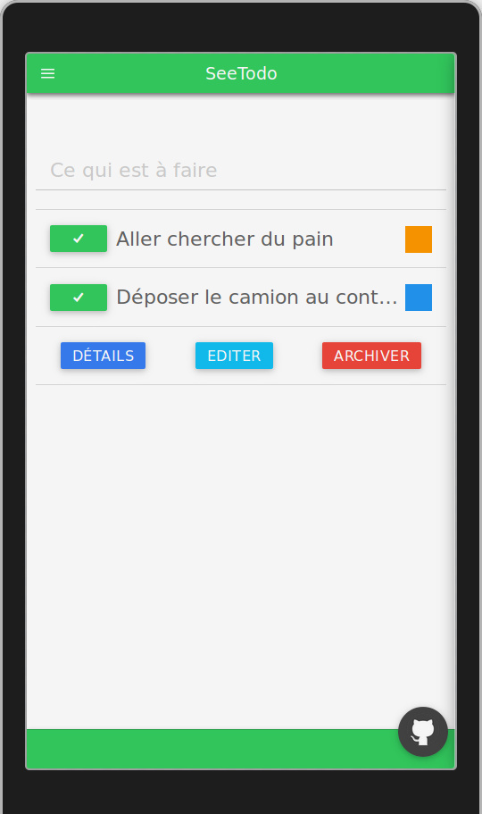
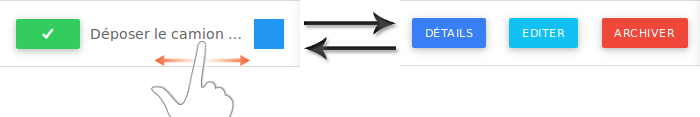
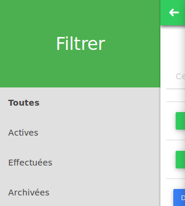

# Documentation utilisateurs

## L'écran d’accueil

- En haut à gauche se trouve un bouton permettant d'afficher le menu.
- Le champ *"ce qui est à faire"* vous permet d'ajouter de nouvelles tâches.
- La liste des tâches :
  - Le premier bouton permet de passer le spécifier que vous avez effectué une tâche.
  - A droite se trouve la couleur définissant la catégorie de la tâche (par exemple ici nous avons le bleu pour les tâches professionnelles et l'orange pour les personnelles).

## Le swipe

- Vous pouvez faire glisser une tâche pour accéder aux boutons.
- Les boutons :
  - Détails -> Affiche les informations détaillées de la tâche.
  - Éditer -> Permet d'ajouter ou modifier des informations concernant la tâche.
  - Archiver -> Permet de supprimer une tâche.

## Le menu

  - Toutes -> Affiche toutes les tâches.
  - Actives -> N'affiche que les tâches pas encore effectuées.
  - Effectuées -> N'affiche que les tâches déjà effectuées.
  - Archivées -> Affiche les tâches supprimées, et permet de supprimer toutes les données.

**Pour tout problème ou demande n'hésitez pas à me contacter via la [page dédiée](https://github.com/Jbz797/SeeTodo/issues)**
