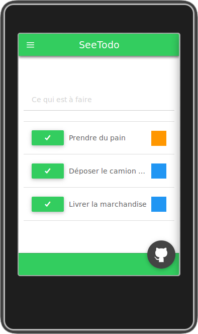

# Documentation utilisateurs

## L'écran d'acceuil

- En haut à gauche se trouve un bouton permettant d'afficher le menu.
- Le champ *"ce qui est à faire"* vous permet d'ajouter de nouvelles tâches.
- La liste des tâches :
  - Le premier bouton permet de passer le spécifier que vous avez effectué une tâche.
  - A droite se trouve la couleur définissant la catégorie de la tâche (par exemple içi nous avons le bleu pour les tâches professionnelles et l'orange pour les personnelles).
