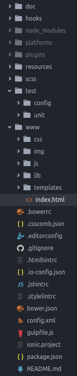

# Documentation technique

## Arborescence

#### package.json et bower.json
Contiennent la liste de toutes les dépendances (`npm install` pour les installer).
#### gulpflie.js
Gulp est un tasks runners, outil permettant d'automatiser les tâches de développement récurrentes. Après l'avoir installé globalement (`npm install -g gulp`) vous pouvez le lancer avec la commande `gulp`. Les tâches suivantes seront exécutées:
- **sass** -> Minifie et concatène les fichiers *css*.
- **js** -> Minifie et concatène les fichiers *js*.
- **bump** -> Incrémente les versions du *bower.json* et du *package.json*.
- **git** -> Commit automatique de la nouvelle version.
- **watch** -> Surveille les fichiers *sass* et *js* et lance les tâches précédentes à toute modification.

#### config.xml
Contient les informations concernant le projet *Ionic*.
#### .stylelinttrc, .jshintrc, .htmlhintrc et .csscomb.json
Options des linters.
#### .gitignore
Liste les fichiers/dossiers à ignorer par git.
#### .editorconfig
Active certaines règles concernant l'éditeur (compatible avec la majorité des éditeurs ou IDE).
#### ./hooks/
Ce dossier contient tous les scripts liés à *Cordova*.
#### ./plugins/
Ce dossier contient les plugins *Cordova*.
#### ./resources/
Ce dossier contient notamment les icônes de l'application.
#### ./test/
Ce dossier contient les tests unitaires (`npm test` pour les lancer).
#### ./www/
Ici se trouve le cœur du projet, notamment les fichiers *css*, *js* et *html*.

## Informations complémentaires
- Vous trouverez beaucoup de commentaires à l'intérieur des fichiers, vous permettant de mieux comprendre la logique de l'application.
- Le projet suis les recommandations, conventions et structurations du [style guide de *Johnpapa*](https://github.com/johnpapa/angular-styleguide/blob/master/a1/README.md). Merci de les respecter si vous participez au projet.

## Contact
**SeeTodo est un projet libre et collaboratif, n'hésitez donc pas à Fork !**
**Pour tout problème ou demande n'hésitez pas à reporter via la [page dédiée](https://github.com/Jbz797/SeeTodo/issues).**
